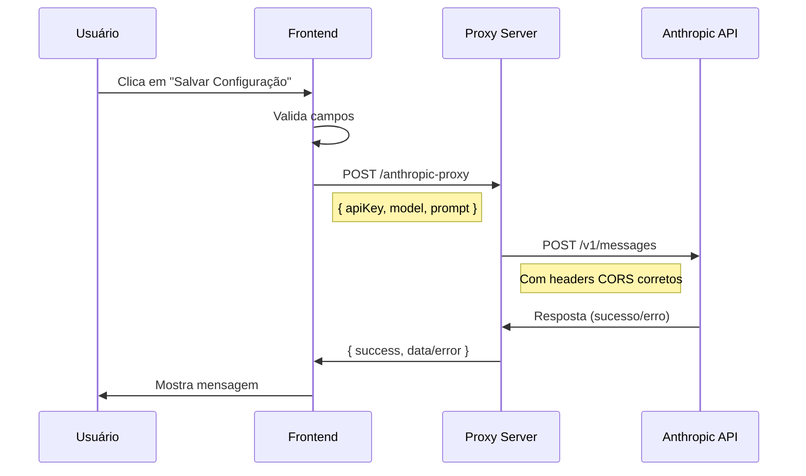
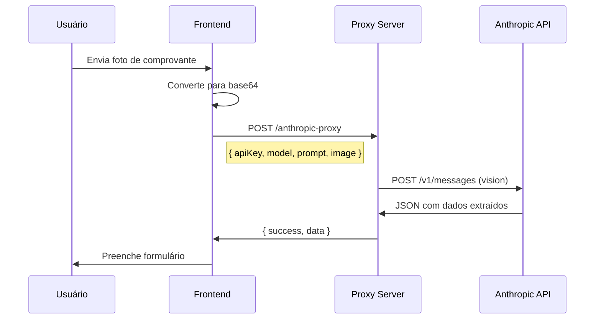

# Configuração Segura da Integração Anthropic Claude

Este documento detalha a implementação da solução de proxy para integração segura com a API da Anthropic Claude, resolvendo problemas de CORS e mantendo boas práticas de segurança.

## 📋 Sumário

- [Problema Original](#problema-original)
- [Solução Implementada](#solução-implementada)
- [Arquitetura](#arquitetura)
- [Como Usar](#como-usar)
- [Segurança](#segurança)
- [Testes](#testes)
- [Troubleshooting](#troubleshooting)

## 🔴 Problema Original

### Erro "fail to fetch" com CORS

A API da Anthropic bloqueia requisições CORS (Cross-Origin Resource Sharing) vindas diretamente do navegador. Isso significa que chamadas diretas do frontend para `https://api.anthropic.com/v1/messages` resultam em erro:

```
Access to fetch at 'https://api.anthropic.com/v1/messages' from origin 'http://localhost:3000' 
has been blocked by CORS policy: No 'Access-Control-Allow-Origin' header is present on the requested resource.
```

### Por que outros provedores funcionam?

- **Google Gemini**: Permite CORS para chamadas do navegador ✅
- **OpenAI**: Permite CORS para chamadas do navegador ✅
- **Anthropic Claude**: Bloqueia CORS por questões de segurança ❌

## ✅ Solução Implementada

### Servidor Proxy Express

Criamos um servidor proxy Node.js/Express que:

1. **Recebe** requisições do frontend com a chave API
2. **Encaminha** a requisição para a API da Anthropic
3. **Retorna** a resposta ao frontend

```
Frontend → Proxy Server → Anthropic API → Proxy Server → Frontend
```

### Arquivos Modificados

1. **`server/anthropic-proxy.js`** (NOVO)
   - Servidor Express na porta 3001
   - Endpoint `/anthropic-proxy` para requisições
   - Endpoint `/health` para verificação de status
   - Suporte para API de texto e visão (imagens)

2. **`src/components/Settings/AIConfigSettings.jsx`**
   - Atualizado para usar proxy ao testar chave Claude
   - Mensagens de erro específicas para problemas de conexão

3. **`src/services/import/photoExtractorAI.js`**
   - Função `callClaudeVision` atualizada para usar proxy
   - Suporte para envio de imagens base64

4. **`src/services/import/smsExtractorAI.js`**
   - Função `callClaude` atualizada para usar proxy
   - Extração de texto de SMS

5. **`src/services/import/aiService.js`**
   - Função `callClaude` atualizada para usar proxy
   - Categorização de transações

6. **`package.json`**
   - Adicionadas dependências: `express`, `cors`
   - Adicionado script `npm run proxy`

7. **`README.md`**
   - Documentação sobre como usar o proxy

## 🏗️ Arquitetura

### Fluxo de Requisição - Teste de Chave API



### Fluxo de Requisição - Extração de Foto



## 🚀 Como Usar

### 1. Instalação

As dependências já foram instaladas. Se precisar reinstalar:

```bash
npm install
```

### 2. Iniciar o Proxy Server

**Opção A - Com npm script:**
```bash
npm run proxy
```

**Opção B - Diretamente:**
```bash
node server/anthropic-proxy.js
```

**Saída esperada:**
```
🚀 Anthropic proxy server running on port 3001
📡 Endpoint: http://localhost:3001/anthropic-proxy
💚 Health check: http://localhost:3001/health
```

### 3. Iniciar o Frontend

Em outro terminal:
```bash
npm start
```

### 4. Configurar a Chave API

1. Acesse **Configurações** → **IA**
2. Selecione **Anthropic Claude**
3. Escolha o modelo (recomendado: Claude 3.5 Sonnet)
4. Cole sua chave API
5. Clique em **Salvar Configuração**

O sistema testará automaticamente a conexão com o proxy e a validade da chave.

## 🔒 Segurança

### O que fazemos para manter segurança:

✅ **Chave API não é armazenada no servidor**
- A chave é enviada do frontend em cada requisição
- O servidor apenas a encaminha para a Anthropic
- Não há persistência ou logging da chave

✅ **Nenhuma chave no código-fonte**
- Todas as chaves são fornecidas pelo usuário via UI
- Não existem chaves hardcoded

✅ **CORS configurado corretamente**
- O proxy aceita requisições do frontend
- A Anthropic recebe requisições do servidor (sem CORS)

✅ **Separação de responsabilidades**
- OpenAI e Gemini: chamadas diretas (seguras)
- Anthropic: via proxy (necessário)

### O que o usuário deve fazer:

⚠️ **Proteja sua chave API**
- Não compartilhe sua chave
- Não commite chaves no Git
- Use chaves com permissões mínimas necessárias

⚠️ **Em produção**
- Configure HTTPS/SSL no proxy
- Use variáveis de ambiente para configuração
- Considere autenticação adicional no proxy

## 🧪 Testes

### Teste Manual do Servidor

```bash
# Inicie o servidor
npm run proxy

# Em outro terminal, teste os endpoints
curl http://localhost:3001/health
# Deve retornar: {"status":"ok","service":"anthropic-proxy"}

curl -X POST http://localhost:3001/anthropic-proxy \
  -H "Content-Type: application/json" \
  -d '{"model":"test","prompt":"test"}'
# Deve retornar: {"success":false,"error":"API key is required"}
```

### Teste com Chave Válida

Obtenha uma chave em: https://console.anthropic.com/settings/keys

```bash
curl -X POST http://localhost:3001/anthropic-proxy \
  -H "Content-Type: application/json" \
  -d '{
    "apiKey": "sua-chave-aqui",
    "model": "claude-3-5-sonnet-20241022",
    "prompt": "Responda apenas com OK",
    "maxTokens": 10
  }'
```

Resposta esperada:
```json
{
  "success": true,
  "data": {
    "content": [{"text": "OK"}],
    ...
  }
}
```

## 🔧 Troubleshooting

### Erro: "Falha ao conectar com o servidor proxy"

**Causa:** O proxy não está rodando ou está em outra porta.

**Solução:**
1. Verifique se o servidor está rodando: `curl http://localhost:3001/health`
2. Se não estiver, inicie: `npm run proxy`
3. Verifique se a porta 3001 está livre: `lsof -i :3001`

### Erro: "Failed to call Anthropic API"

**Causa:** Chave API inválida ou sem créditos.

**Solução:**
1. Verifique sua chave em: https://console.anthropic.com/settings/keys
2. Confirme que há créditos disponíveis na conta
3. Teste a chave diretamente na API da Anthropic

### Erro de CORS mesmo com proxy

**Causa:** Frontend está chamando API diretamente ao invés do proxy.

**Solução:**
1. Verifique se o código está usando o proxy
2. Limpe o cache do navegador: Ctrl+Shift+R
3. Verifique o console do navegador para ver a URL sendo chamada

### Proxy funciona em desenvolvimento mas não em produção

**Causa:** URL do proxy está hardcoded para localhost.

**Solução:**
Configure a variável de ambiente:
```bash
REACT_APP_ANTHROPIC_PROXY_URL=https://seu-dominio.com/anthropic-proxy
```

## 🌐 Variáveis de Ambiente

### Frontend (opcional)

```bash
# URL customizada do proxy
REACT_APP_ANTHROPIC_PROXY_URL=http://localhost:3001/anthropic-proxy
```

### Backend (opcional)

```bash
# Porta do servidor proxy
PORT=3001
```

## 📚 Recursos Adicionais

- [Documentação da API Anthropic](https://docs.anthropic.com/claude/reference/getting-started-with-the-api)
- [CORS Explicado](https://developer.mozilla.org/en-US/docs/Web/HTTP/CORS)
- [Express.js Documentation](https://expressjs.com/)

## 🎯 Conclusão

Esta implementação resolve o problema de CORS da Anthropic de forma segura e eficiente, permitindo que o sistema use Claude para extração inteligente de dados enquanto mantém OpenAI e Gemini funcionando diretamente do frontend.

**Vantagens:**
- ✅ Resolve CORS sem comprometer segurança
- ✅ Mantém compatibilidade com outros provedores
- ✅ Fácil de configurar e usar
- ✅ Testado e documentado

**Próximos passos recomendados:**
- [ ] Deploy do proxy em servidor de produção
- [ ] Configuração de HTTPS/SSL
- [ ] Implementação de rate limiting
- [ ] Monitoramento e logs
